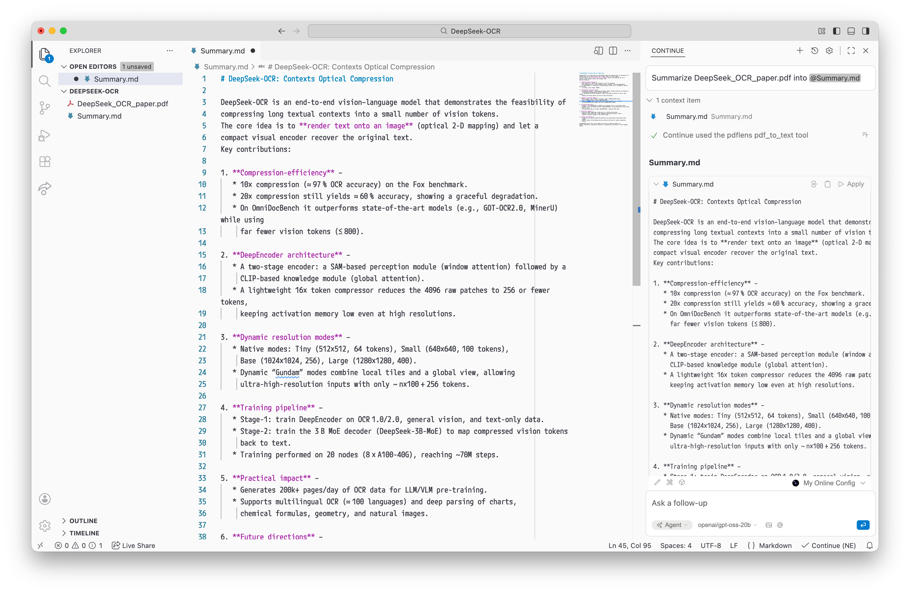

pdflens-mcp
===========

[](https://crates.io/crates/pdflens-mcp)

An MCP server for reading PDFs, coded by human, designed for AI.



## Provided tools

* `get_pdf_num_pages`
* `read_pdf_as_text`
* `convert_pdf_to_images`‡
* `list_mcp_root_paths`

‡ Not all MCP clients support images.

## Usage

1.  Install Rust compiler: https://rustup.rs/

2.  Download and build pdflens-mcp from [crates.io](https://crates.io/crates/pdflens-mcp)

    ```bash
    cargo install pdflens-mcp
    ```

    Usually, the program is installed to `$HOME/.cargo/bin/pdflens-mcp`. You can use `cargo install --root /another/path pdflens-mcp` to set a custom installation path.

3.  Add this MCP server to your MCP client of choice.

    1. If your MCP client supports `mcp.json`:

        ```json
        {
          "mcpServers": {
            "pdflens": {
              "command": "sh",
              "args": ["-c", "exec ~/.cargo/bin/pdflens-mcp"]
            }
          }
        }
        ```

    2. VS Code:

        ```bash
        code --add-mcp "{\"name\": \"pdflens\", \"command\": \"sh\", \"args\": [\"-c\", \"exec ~/.cargo/bin/pdflens-mcp\"]}"
        ```

    3. Continue.dev

        ```yaml
        mcpServers:
          - name: pdflens
            command: sh
            args:
              - -c
              - exec ~/.cargo/bin/pdflens-mcp
        ```

    4. Codex

        ```toml
        [mcp_servers.pdflens]
        command = "sh"
        args = ["-c", "exec ~/.cargo/bin/pdflens-mcp"]
        ```

## Path sandboxing

Pdflens is designed to only read PDFs located within the MCP root paths, which is usually the user’s workspace.

Each time before reading the PDFs, it checks the file path after resolving any symbolic links. If the PDF exists but is outside any MCP root paths, pdflens will return an error, asking the user to check the root path settings.

If your MCP client doesn’t specify a root path, pdflens will fallback to the current directory it is started in.

```json
{
  "mcpServers": {
    "pdflens": {
      "command": "sh",
      "args": ["-c", "exec ~/.cargo/bin/pdflens-mcp"],
      "cwd": "/path/to/workspace/if/root/path/is/unsupported"
    }
  }
}
```

In case if you need to diagnose MCP root paths, `list_mcp_root_paths` can be helpful.

## Not-vibe-coded declaration

This project is developed mainly with human effort. I have throughoutly read and checked every piece of code in this repository to ensure its quality.
